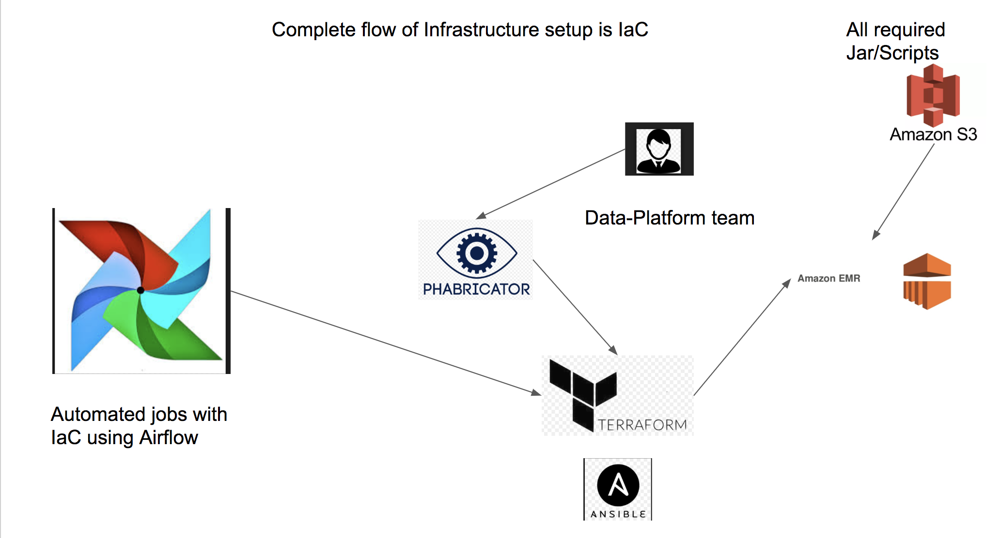

# everythingIdo
This repo has everything I have done till now in the during my worklife.

The Below is one of the complete Design I have build at my company.

Cloudera Certified Administrator for Apache Hadoop (CCAH) 
Data Engineering/DevOps
Learning : Attempting AWS Solution Architect Certification

In simple words I build and maintain the below 

Code to get data(Scala and AWS commands ) --> Code to build the platform(terraform , AWS EMR)---> Code to transform the data (Scala & Linux) ---> Code to build the infra to query this data (Presto) ---> Code to maintain this infra (Error logging ELK, Slack alerts, real-time monitoring and self healing)

![Screenshot]
![Screenshot]
![Screenshot]! [Screenshot](Screen Shot 2018-05-28 at 2.28.44 PM.png)
