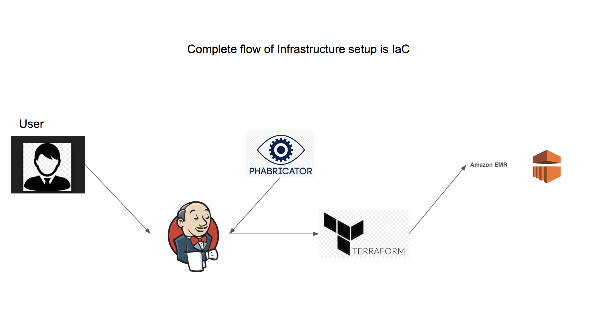
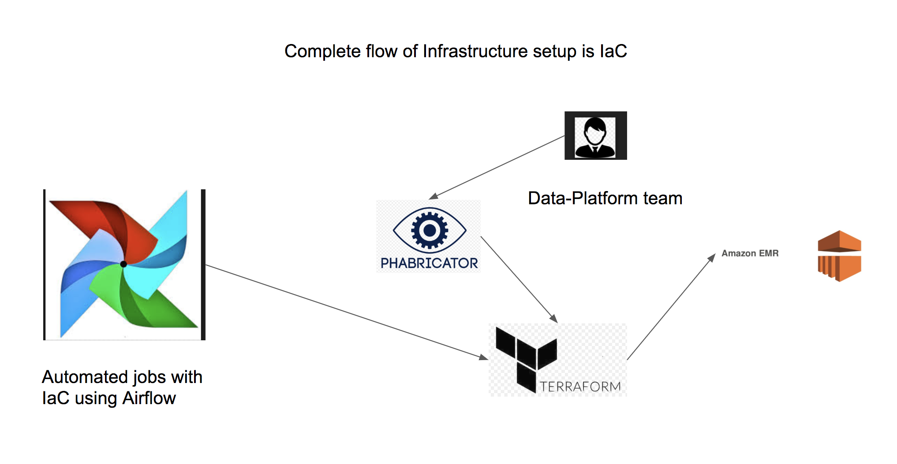

# everythingIdo
This repo has everything I have done till now in the during my worklife

# Everything about Big Data Platform --- Infrastructer as Code (IaC)

The repo is divided into multpile sections

  - simple-emr 
  - emr-2-spot-with-bootstrap
  - emr-2-spot-with-bootstrap-with-step-function
  - How to run this jobs

# How to use : simple-emr

  - The cluster is a test cluster 
  - You can use it for all kind of different POC that you plan to do 
  - Timeout of the cluster will be set to 1 hour 
  - This does not connect to any of our Hive Tables .

# emr-2-spot-with-bootstrap 
  - Close to Prod cluster 
  - Timeout of the cluster will be set to 1 hour
  - You can use it for all kind of different POC that you plan to do 
  - All kind of temporary tables created will be stored and can be accessed via Presto on later section
  - Timeout on this cluster is 1 hour 
 

# emr-2-spot-with-bootstrap-with-step-function
  - Prodcution Cluster
  - Dump the hql file in S3 and change the file name in S3 step function in main.tf file
  - The cluster will spin automaatically or by Jenkins job then runs the Hive script and will get terminated once the job is completed 
  
![Screenshot]
![Screenshot]
